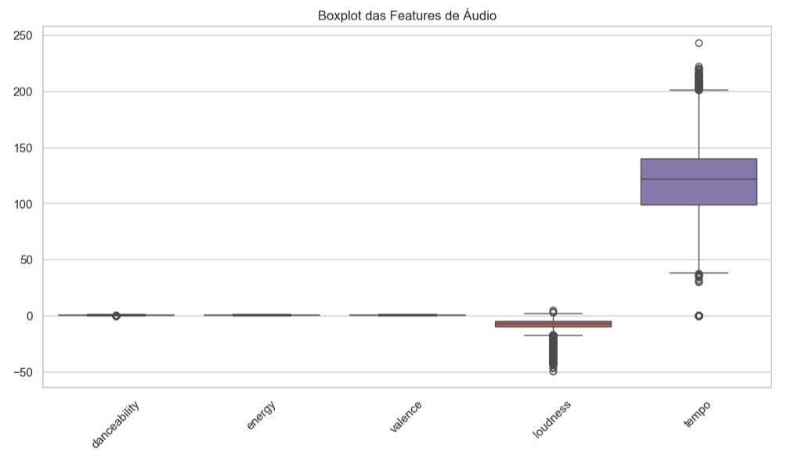
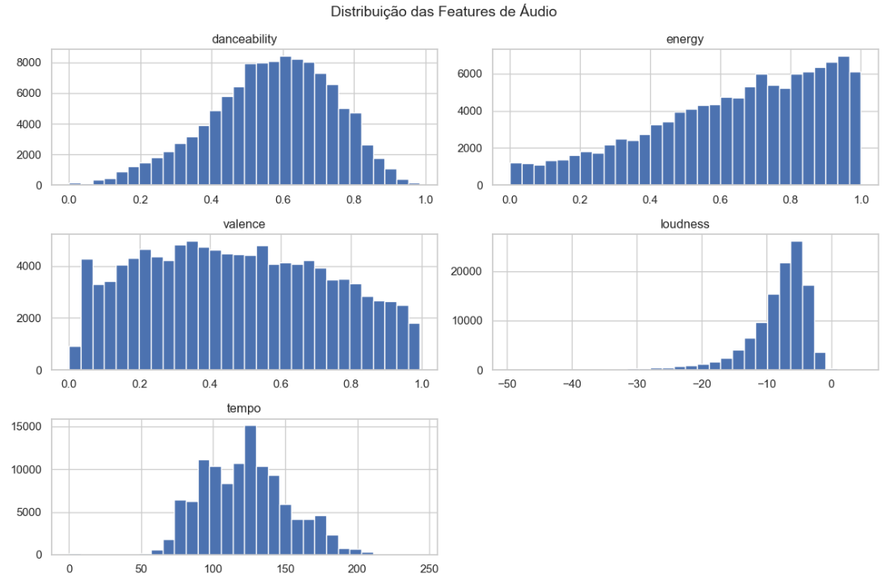

# Spotify Tracks – Exploratory Data Analysis (EDA)

Este projeto apresenta uma análise exploratória de dados (EDA) utilizando um conjunto
de dados do Spotify contendo informações sobre faixas musicais, características de áudio,
popularidade e gêneros musicais.

## Objetivo

Explorar o dataset para compreender a distribuição das variáveis, identificar padrões
sonoros, analisar diferenças entre gêneros musicais e investigar relações entre
características de áudio e popularidade.

## Dataset

- Fonte: Kaggle – Spotify Tracks / Audio Features
- Tamanho: ~114.000 faixas
- Variáveis:
  - Características de áudio (danceability, energy, loudness, tempo, valence, etc.)
  - Popularidade (0–100)
  - Informações categóricas (artista, nome da faixa, gênero musical)

## Ferramentas Utilizadas

- Python
- Pandas
- NumPy
- Matplotlib
- Seaborn
- Jupyter Notebook

## Principais Etapas da Análise

1. Carregamento e inspeção inicial dos dados
2. Limpeza mínima (remoção de coluna irrelevante e poucos valores ausentes)
3. Análise univariada das características de áudio
4. Análise de popularidade por gênero musical
5. Análise bivariada entre atributos de áudio e popularidade
6. Análise exploratória de artistas em gêneros associados à música brasileira

## Observações Importantes

A métrica de popularidade utilizada é fornecida pelo Spotify e não representa o número
real de reproduções. Além disso, o dataset não contém informações por país, portanto
as análises com foco em gêneros brasileiros devem ser interpretadas como aproximações
exploratórias.

## Conclusão

A análise mostrou que as características de áudio, isoladamente, apresentam correlação
limitada com a popularidade das músicas, destacando a complexidade dos fatores que
influenciam o sucesso musical. O projeto demonstra a aplicação de técnicas básicas de
análise exploratória de dados e visualização, servindo como estudo introdutório em
ciência de dados.
- Aplicação de modelos simples de machine learning
- Integração com dados externos ou APIs

